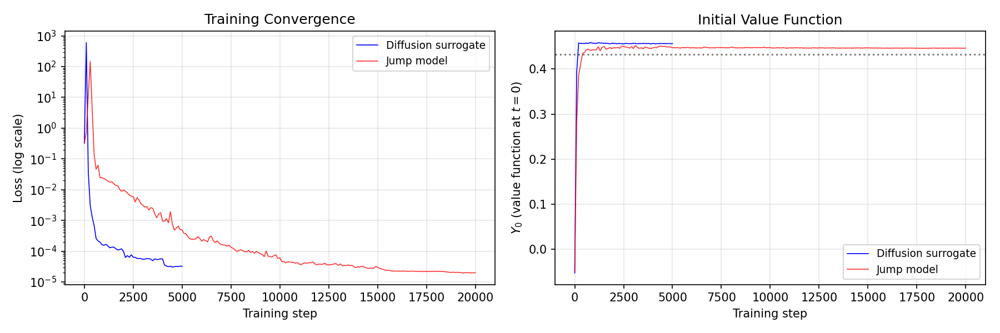

# A Deep Jump-BSDE Solver for Optimal Market-Making in Limit Order Books

**[Read the paper (PDF)](paper.pdf)**

A PyTorch implementation of a deep BSDE-inspired solver for optimal market-making, preserving the discrete Poisson inventory jump structure of the Cont-Xiong (2024) dealer market model. Validated against finite-difference ground truth with cross-dynamics policy evaluation.

## Key Results

| Method | Y₀ | Loss | Spread | Error vs FD |
|--------|-----|------|--------|-------------|
| FD finite-horizon (ground truth) | **0.457** | exact | 1.370 | — |
| Deep BSDE surrogate (5 seeds) | 0.457 ± 0.000 | 3.4e-05 | 1.333 | <0.1% |
| Deep BSDE jump (20k iter) | 0.446 ± 0.002 | 2.2e-05 | discrete | 2.4% |

**Core finding:** Accurate value approximation does not guarantee accurate control recovery — the surrogate achieves <0.1% value error but 2.7% spread distortion. Despite this, a surrogate-trained policy deployed under true Poisson execution captures 99.3% of FD-optimal P&L.

## Figures

### Training and Quoting
<p float="left">


</p>

### Value Function and Ground Truth Comparison
<p float="left">


</p>

### Gradient Surface and Quote Skew
<p float="left">


</p>

### Breaking Points and Sensitivity
<p float="left">


</p>

### Policy Simulation


## Installation

```bash
git clone https://github.com/cgarryZA/DeepBSDE.git
cd DeepBSDE
pip install torch numpy matplotlib
```

For GPU support:
```bash
pip install torch --index-url https://download.pytorch.org/whl/cu124
```

## Quick Start

**Train the continuous LOB solver:**
```bash
python main.py --config configs/lob_d2.json --exp_name demo --log_dir ./logs --device auto
```

**Train the jump-diffusion solver:**
```bash
python main.py --config configs/lob_d2_jump.json --exp_name jump_demo --log_dir ./logs --device auto
```

**Generate plots:**
```bash
python scripts/plot_lob.py --config configs/lob_d2.json \
    --result logs/demo_result.txt \
    --weights logs/demo_model.pt \
    --out_dir plots
```

**Run the full experiment suite:**
```bash
python scripts/run_all_experiments.py --device cuda        # full (5 seeds, ~12 hours)
python scripts/run_all_experiments.py --quick --device cuda  # quick (2 seeds, ~1.5 hours)
```

**Find the solver's breaking point:**
```bash
python scripts/find_breaking_point.py --param gamma --lo 0.1 --hi 5.0 --penalty exponential
```

**Forward policy simulation:**
```bash
python scripts/simulate_policy.py --weights logs/demo_model.pt
```

## Repository Structure

```
DeepBSDE/
├── paper.pdf                        # Preprint (14 pages)
├── main.py                          # Training entry point
├── solver.py                        # All model + solver classes
├── config.py                        # Configuration dataclasses
├── registry.py                      # Equation registration
├── equations/
│   ├── base.py                      # Abstract base class
│   ├── sinebm.py                    # Sine-BM benchmark (Han-Hu-Long 2022)
│   ├── flocking.py                  # Cucker-Smale MFG
│   ├── contxiong_lob.py             # Diffusion surrogate (Option A)
│   └── contxiong_lob_jump.py        # Jump-BSDE solver (Option B)
├── configs/                         # JSON experiment configs
├── scripts/
│   ├── plot_lob.py                  # Main visualization suite
│   ├── plot_experiments.py          # Experiment result plots
│   ├── plot_grid_comparison.py      # FD vs BSDE full-grid comparison
│   ├── simulate_policy.py           # Forward P&L simulation
│   ├── find_breaking_point.py       # Binary search for instability
│   ├── finite_difference_baseline.py        # Stationary FD solver
│   ├── finite_difference_finite_horizon.py  # Matched finite-horizon FD
│   ├── run_experiments.py           # Basic experiment runner
│   └── run_all_experiments.py       # Full experiment suite
└── plots/                           # Generated figures
```

## Configuration

Key parameters in `configs/lob_d2.json`:

| Parameter | Default | Description |
|-----------|---------|-------------|
| `sigma_s` | 0.3 | Mid-price volatility |
| `lambda_a`, `lambda_b` | 1.0 | Order arrival rates |
| `alpha` | 1.5 | Execution probability decay |
| `phi` | 0.01 | Inventory penalty coefficient |
| `discount_rate` | 0.1 | Discount rate r |
| `penalty_type` | `"quadratic"` | `"quadratic"`, `"cubic"`, or `"exponential"` |
| `num_time_interval` | 50 | Euler-Maruyama time steps |

## Citation

```bibtex
@misc{garry2026deepbsdelob,
  author       = {Christian Garry},
  title        = {A Deep Jump-{BSDE} Solver for Optimal Market-Making
                  in Limit Order Books},
  year         = {2026},
  howpublished = {\url{https://github.com/cgarryZA/DeepBSDE}},
}
```

## References

- Cont, R. & Xiong, W. (2024). Dynamics of market making algorithms in dealer markets. *Mathematical Finance*, 34:467-521.
- Han, J., Jentzen, A. & E, W. (2018). Solving high-dimensional PDEs using deep learning. *PNAS*, 115(34):8505-8510.
- Han, J., Hu, R. & Long, J. (2022). Learning high-dimensional McKean-Vlasov FBSDEs. *SIAM J. Numer. Anal.*, 60(4):2208-2232.
- Avellaneda, M. & Stoikov, S. (2008). High-frequency trading in a limit order book. *Quantitative Finance*, 8(3):217-224.
- Andersson, K. et al. (2023). A deep solver for BSDEs with jumps. *arXiv:2211.04349*.

## License

MIT
